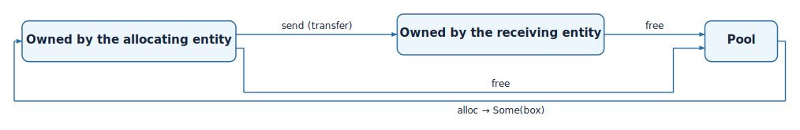

# Memory Management

Termina has no general-purpose heap. There is no `malloc`, no `free`, and no
implicit allocation anywhere in the language: a program never acquires memory
behind the programmer's back, and it never depends on an allocator whose timing
cannot be bounded. When an application does need to allocate and release storage
at run time, it does so through memory pools, a mechanism that is dynamic yet
fully deterministic. This chapter describes pools, the owned blocks that come
from them, and the atomic arrays that provide lock-free shared storage.

## Memory pools

A pool is a resource that manages a fixed number of preallocated blocks, all of
the same type. It is declared in the application module with the built-in
`Pool` type, the type of the blocks, and how many of them the pool contains:

```termina
resource sample_pool : Pool<Sample; 8>;
```

This pool holds eight blocks, each large enough for one `Sample`. The blocks
exist for the lifetime of the program; allocating one hands it out for use, and
releasing it returns it to the pool. Because the number of blocks is fixed and
reserved in advance, the memory the application uses is known when it is built,
and allocation never fails for want of space beyond the pool's stated capacity.

## Allocating from a pool

An entity reaches a pool through an access port of type `Allocator<T>`. The
`alloc` operation does not return a block directly, since the pool may be
exhausted; it sets an `Option`, which holds the block when one was available and
is empty otherwise. The caller must therefore handle both cases:

=== "Termina"
    ```termina
    action tick(&priv self, _current_time : TimeVal) -> Status<i32> {
        var status : Status<i32> = Success;
        var opt : Option<box Sample> = None;
        self->pool_port.alloc(&mut opt);
        match opt {
            case Some(b) => {
                b.value = 7;
                self->out_port.send(b);
            }
            case None => {
                status = Failure(-1);
            }
        }
        return status;
    }
    ```
=== "C"
    ```c
    __status_int32_t CCollector__tick(const __termina_event_t * const __ev,
                                      void * const __this, TimeVal _current_time) {

        CCollector * self = (CCollector *)__this;

        __status_int32_t status = { .__variant = Success };

        __option_box_t opt = { .__variant = None };

        self->pool_port.alloc(__ev, self->pool_port.__that, &opt);

        if (opt.__variant == Some) {

            __termina_box_t b = opt.Some.__0;

            (*(Sample *)b.data).value = 7U;

            __termina_out_port__send(__ev, self->out_port, (void *)&b);

        } else {

            status.__variant = Failure;
            status.Failure.__0 = -(1L);

        }

        return status;

    }
    ```

When the allocation succeeds, the block is delivered as a value of type
`box Sample`. The fields of the block are reached directly through the box, as in
`b.value = 7`, without any explicit dereferencing.

## Owned blocks

A `box T` is an owned handle to a block of memory taken from a pool. Ownership in Termina is
linear: a `box` must be consumed exactly once. It can be released back to its
pool, or it can be handed to another component, but it cannot be copied, and it
cannot simply go out of scope while still holding a block. The transpiler tracks
each `box` through the body that holds it and rejects any path that would leave a
block neither released nor passed on, or that would use a block after it has
already been given away. This discipline is what guarantees, at compile time,
that the memory managed by a pool is never leaked and never used after it has been freed.

The life of a block is summarized by the following diagram: it leaves the
pool through `alloc`, is owned by exactly one component at a time, may change
hands through a channel, and returns to the pool through `free`.

<figure markdown="span">
{ .diagram }
<figcaption>The life of a box: allocated from a pool, transferred through a channel, and freed</figcaption>
</figure>

A block is consumed in one of two ways. The first is to release it explicitly,
returning it to the pool with `free`:

=== "Termina"
    ```termina
    action receive(&priv self, sample : box Sample) -> Status<i32> {
        let status : Status<i32> = Success;
        self->pool_port.free(sample);
        return status;
    }
    ```
=== "C"
    ```c
    __status_int32_t CSink__receive(const __termina_event_t * const __ev,
                                    void * const __this, __termina_box_t sample) {

        CSink * self = (CSink *)__this;

        __status_int32_t status = { .__variant = Success };

        self->pool_port.free(__ev, self->pool_port.__that, sample);

        return status;

    }
    ```

The second is to transfer it. Sending a `box` through an output port, as the
allocating action did with `self->out_port.send(b)`, passes ownership of the
block to whoever receives the message. The sender no longer owns the block after
the send, and the transpiler will reject any later use of it. On the receiving
side, the block arrives as the `box` argument of the triggered action, and the
receiver becomes responsible for consuming it in turn, as the `receive` action
above does by freeing it. This is how a block of data moves from one component to
another without being copied and without any ambiguity about who must release it.

## Atomic variables and arrays

Pools provide owned, exclusive blocks. For data that several entities must read
and update concurrently, Termina offers a different mechanism, one that takes no
lock: the atomic variable, and its array form.

An atomic variable holds a single value that is read and written as one
indivisible operation. It is declared as a resource of the built-in `Atomic`
type, with its element type and initial value:

```termina
resource flag : Atomic<u32> = {
    value = 0
};
```

An entity reaches it through an access port of type `AtomicAccess<T>`, and reads
and writes it with `load` and `store`:

=== "Termina"
    ```termina
    action tick(&priv self, _current_time : TimeVal) -> Status<i32> {
        let status : Status<i32> = Success;
        var v : u32 = 0;
        self->flag_port.load(&mut v);
        self->flag_port.store(v + 1);
        return status;
    }
    ```
=== "C"
    ```c
    __status_int32_t CMonitor__tick(const __termina_event_t * const __ev,
                                    void * const __this, TimeVal _current_time) {

        CMonitor * self = (CMonitor *)__this;

        __status_int32_t status = { .__variant = Success };

        uint32_t v = 0U;

        v = atomic_load(self->flag_port);

        atomic_store(self->flag_port, v + 1U);

        return status;

    }
    ```

An atomic array applies the same idea to a fixed number of elements. It is
declared with the `AtomicArray` type, its element type, its size, and its initial
values, and it is reached through an access port of type
`AtomicArrayAccess<T; N>`, whose `load_index` and `store_index` operations read
and write one element at a time:

```termina
resource bank : AtomicArray<u32; 4> = {
    values = [0; 4]
};
```

=== "Termina"
    ```termina
    self->bank_port.load_index(0, &mut v);
    self->bank_port.store_index(1, v + 1);
    ```
=== "C"
    ```c
    v = atomic_load(&self->bank_port[0U]);

    atomic_store(&self->bank_port[1U], v + 1U);
    ```

Each access, whether to a variable or to one element of an array, compiles to a
single atomic load or store, with no lock taken. Atomics are therefore suited to
small, independent values that are shared across entities and read or written one
at a time, where the cost and the blocking of a mutex would be unwarranted.
Unlike an ordinary resource, whose procedures run under mutual exclusion, an
atomic offers no way to keep several values consistent with one another across a
sequence of operations; its guarantee is confined to the atomicity of each
individual access.
