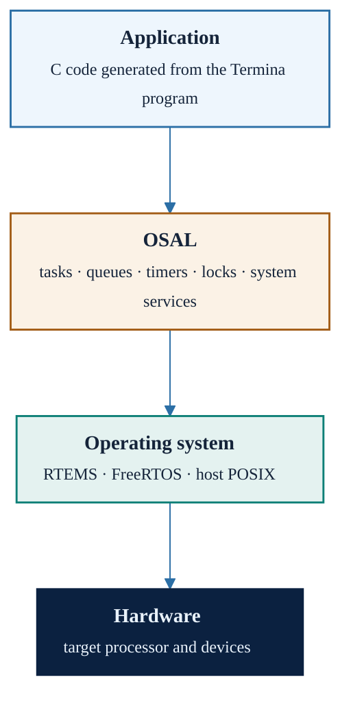

# Platforms and the OSAL

A Termina program never calls an operating system directly. The C code that
the transpiler emits is written against a fixed interface, the Termina
Operating System Abstraction Layer (OSAL), and each supported platform
provides an implementation of that interface on top of its own operating
system and toolchain. This chapter describes the resulting execution stack,
the services the OSAL provides, and the platforms that are currently
supported.

## The execution stack

From source to hardware, a deployed application has four layers:

The generated code is the same for every platform; only the layers beneath it
change. All the primitives that the reactive model relies on reach the
operating system through OSAL functions: the thread and message queue behind
each task, the timers behind the periodic emitters, the locks behind resource
protection, and the atomic operations behind the atomic types. The transpiler
emits calls such as `__termina_msg_queue__recv` or
`__termina_resource__lock`, and the OSAL maps them onto the corresponding
RTEMS directives, FreeRTOS API calls, or POSIX functions.

Because nothing in the generated code names the operating system underneath,
the same application that will eventually run on a flight computer can be
developed and functionally tested on a desktop under the `posix-gcc`
platform.

## System services and `system_entry`

Beyond the primitives that the generated code uses internally, the OSAL
offers a set of services that application code can call explicitly. They are
exposed through the built-in `SystemAPI` interface, implemented by the
runtime-provided `system_entry` resource that the installation and
hello-world chapters introduced. Its procedures fall into three groups:

- **Time**. `clock_get_uptime` returns the elapsed time since boot as a
  `TimeVal`, and `delay_in` suspends the caller for a given interval.
- **Console output**. `print` and `println` write a character array;
  `print_char` writes a single character; and a family of
  `print_<type>`/`println_<type>` procedures covers every integer type, with
  a `SysPrintBase` argument selecting decimal or hexadecimal notation, as
  well as `f32` and `f64`.
- **Console input**. `read` fills a character array with the bytes available
  on the standard input and reports how many were read.

The console procedures exist on every platform: on `posix-gcc` they use the
host terminal, while on the embedded targets they are routed to a serial
port, which makes them a uniform tracing facility during development. The
`system_entry` resource is deployed only when `enable-system-port` is set in
`termina.yaml`, as described in the chapter on the application module.

## Supported platforms

Termina currently supports three platforms:

| Platform | Operating system | Target | Toolchain |
|:---------|:-----------------|:-------|:----------|
| `posix-gcc` | Host POSIX | Linux or macOS host | host `gcc` |
| `rtems5-leon3-nexysa7` | RTEMS 5 | LEON3 (SPARC V8) | `sparc-rtems5-gcc` (Gaisler RCC) |
| `freertos10-stm32l432xx` | FreeRTOS 10 | STM32L432 (Arm Cortex-M4) | `arm-none-eabi-gcc` |

The `posix-gcc` platform runs Termina applications on a conventional
Unix-like host, which makes it the usual choice for prototyping and
functional validation, and it goes well beyond mapping tasks onto host
threads. Its OSAL implements a single-core,
fixed-priority preemptive scheduler of its own on top of POSIX: each task is
a pthread, but the OSAL keeps per-priority ready queues and suspends and
resumes the threads explicitly, so that at any instant exactly one task runs,
chosen by the same policy an RTOS would apply. Interrupts are emulated with
POSIX signals: a timer signal drives the system tick, and the keyboard
interrupt of the demos is raised by an auxiliary thread that watches the
standard input and signals the process, whose handler then runs with
scheduling suspended, exactly as an interrupt service routine would. The
interrupt-disabling protection that resources may require becomes the
blocking of those signals. The emulation preserves the scheduling logic of
the reactive model, including preemption and priority order, but not its
timing: the host decides when the process runs, so `posix-gcc` validates
functionality and sequencing, not deadlines.

The `rtems5-leon3-nexysa7` platform targets the LEON3, a SPARC V8 processor
widely used in European space missions, running RTEMS 5 on the Digilent
Nexys A7 development board. The `freertos10-stm32l432xx` platform targets the
STM32L432 microcontroller running FreeRTOS 10, representative of the small
Arm-based controllers found in instrumentation and robotics. On both embedded
platforms the build produces an image to be loaded on the board, and the
real-time properties of the reactive model hold as designed.

The platform is selected per project, in `termina.yaml`, and the chapter on
the build system describes how the generated `Makefile` invokes the
corresponding toolchain. The Docker image distributed by the project bundles
all three toolchains, so switching platforms does not require installing
anything.

## Versioning and compatibility

The transpiler and the OSAL are released in lockstep at the `MAJOR.MINOR`
level: a transpiler `vA.B.x` is compatible with any OSAL `vA.B.y`, and a
release that changes the contract between the generated code and the layer
beneath it bumps the minor version of both. The patch level moves
independently on each side. When the toolchain is installed from source, the
two repositories must therefore be checked out at the same major and minor
version, as the installation chapter explains; the Docker image always
bundles a compatible pair.

## Porting to a new platform

Support for a new operating system or board consists of an implementation of
the OSAL interface for it: the
[`termina-osal`](https://github.com/termina-lang/termina-osal) repository
organizes the code as a portable core plus one directory per operating system
and per platform, and a port supplies the operating-system bindings and the
platform definition without modifying the transpiler. The porting interface
is documented in that repository.
