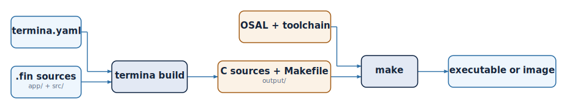

# Project Structure and Build System

A Termina program is organized as a project: a directory with a fixed layout, a
configuration file, and the source modules that make up the application. This
chapter describes that layout, the configuration file that governs it, and the
commands that turn the source into a running program.

## Creating a project

A project is created with the `new` command, which takes the project name and,
optionally, the target platform. When no platform is given, the project is
created for `posix-gcc`, the development platform:

```bash
$ termina new hello_world
```

The command generates the project directory with its initial structure:

```bash
hello_world/
├── termina.yaml
├── app/
│   └── app.fin
├── src/
└── output/
```

## The project layout

The four elements of a new project have distinct roles. The file `termina.yaml`
holds the project configuration. The `app` directory contains the application
module, `app.fin`, where the system is assembled. The `src` directory holds the
source modules that define the component classes and functions of the program.
The `output` directory receives the C code that the transpiler generates, and is
empty until the project is built.

The modules under `src` are organized in subdirectories, and the directory
structure mirrors the dotted paths used in `import` declarations. A module at
`src/resources/counter.fin` is imported as `resources.counter`, and one at
`src/common/types.fin` as `common.types`. A module always belongs to a
subdirectory; the root of `src` holds directories, not modules.

## The configuration file

The `termina.yaml` file records the settings the transpiler needs. A freshly
created project contains the following:

```yaml
app-file: app
app-folder: app
builder: make
efp-folder: efp
name: hello_world
output-folder: output
platform: posix-gcc
source-modules: src
```

The `name` is the name of the project, and `platform` is the target it is built
for. The remaining entries name the parts of the layout: the folder of the
application module and the file within it, the folder of the source modules, the
folder for the generated output, the folder reserved for analysis support files,
and the build tool used to compile that output.

Some features of the runtime are switched on here as well. Setting
`enable-system-port` to `true` deploys the `system_entry` resource that provides
the system interface, and the `platform-flags` section enables platform-specific
sources, such as the keyboard interrupt of the `posix-gcc` platform:

```yaml
enable-system-port: true
platform-flags:
  posix-gcc:
    enable-kbd-irq: true
```

## Building a project

Building a project is a two-stage process: the transpiler turns the Termina
sources into C, and the platform's build system turns that C into a program.

<figure markdown="span">
{ .diagram }
<figcaption>The two build stages: termina build, then make</figcaption>
</figure>

The first stage is transpilation,
carried out by the `build` command from the project's root directory:

```bash
$ termina build
```

The transpiler reads the application module and the source modules, checks the
program, and writes the resulting C into the `output` directory. The output
mirrors the source: a `src` tree of C files, an `include` tree of headers, and a
`Makefile` that knows how to compile them against the Operating System
Abstraction Layer for the configured platform.

The second stage compiles that generated code. On the `posix-gcc` platform, this
is done with `make` from inside the output directory, and it produces an
executable in `bin` that can be run directly:

```bash
$ cd output
$ make
$ ./bin/hello_world
```

For an embedded target, the same two stages apply, but the compilation uses the
cross-toolchain of the chosen platform, and the result is an image to be loaded
onto the device or an emulator rather than an executable for the host.

## Platforms

Termina currently supports three platforms. The `posix-gcc` platform builds the
application for a conventional Unix-like host, using the system's own compiler,
and is intended for development and validation. The `rtems5-leon3-nexysa7`
platform targets the LEON3 processor under RTEMS 5, and the
`freertos10-stm32l432xx` platform targets the STM32L432 microcontroller under
FreeRTOS 10. The platform is chosen when the project is created, with the
`--platform` option of the `new` command, or changed afterwards by editing the
`platform` field in `termina.yaml`. Each target beyond `posix-gcc` requires its
cross-toolchain to be installed, as described in the chapter on installation.
