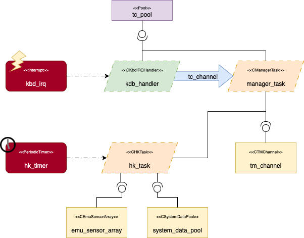

# Building our first application

## Introduction

This section presents a complete example of an application developed in Termina, illustrating the combined use of the language’s primary constructs: resources, tasks, emitters, handlers, message queues, and memory pools.

The goal is to implement a simplified version of the application software of a generic on-board satellite Instrument Control Unit (ICU). In this example, the software will perform two specific functions:

- Housekeeping subsystem: The housekeeping subsystem is responsible for the periodic monitoring of the instrument’s internal state. It collects engineering parameters such as voltages, currents, and internal status flags, aggregates them into data packets, and makes them available for transmission to the spacecraft platform. In this tutorial, this functionality will be emulated by a housekeeping task that periodically gathers synthetic measurement data from a simulated sensing subsystem. Internally, this subsystem will rely on random number generation to produce representative values.

- Telecommand reception and acceptance: In an actual spacecraft, telecommands are sent from the ground segment to control the instrument’s behavior. The on-board software receives these telecommands, validates them, and executes the corresponding actions. In our simplified scenario, telecommand reception will be simulated by user input from the standard input stream. The system will interpret each received character as a telecommand and respond with a corresponding telemetry acknowledgment message.

Together, these two components reproduce the structure of a complete on-board control application, combining periodic housekeeping with asynchronous telecommand handling.

## The Termina Execution Model

Before starting the implementation, it is important to understand the software execution environment that supports Termina applications. The core component of the Termina development toolchain is its transpiler, which translates Termina source code into MISRA-compliant C code. The generated C code does not interact directly with the underlying real-time operating system (RTOS). Instead, it runs on top of the Termina Operating System Abstraction Layer (OSAL). The OSAL defines a uniform and well-specified application programming interface (API) that encapsulates the system services required by Termina applications, such as task scheduling, interrupt handling, synchronization, and inter-process communication. 

Each supported operating system implements its own version of the OSAL, adapting this interface to the primitives of the target RTOS. This design ensures that the transpiler's output is independent of the target platform, while maintaining the language's deterministic semantics and analyzable behavior.  

In this tutorial, we will use the `posix-gcc` platform, a development and demonstration platform included with the Termina toolchain. It allows Termina applications to execute on conventional Unix-like systems such as Linux or macOS. The platform is intended primarily for prototyping and validation, rather than deployment on a real RTOS. Internally, the OSAL implementation for `posix-gcc` emulates real-time behavior using POSIX threads, timers, and synchronization primitives. While it does not provide hard real-time guarantees because execution depends on the host system's scheduler, it preserves the logical structure of a deterministic real-time system, enabling functional testing and behavioral analysis.

The OSAL for this platform exposes a simple interface that emulates:

- an interrupt-like event triggered when there are characters available in the standard input stream buffer (`stdin`), and
- a telemetry output channel that sends messages to the standard output stream (`stdout`).

These features allow us to simulate both telecommand reception and telemetry transmission:

- Telecommands will be represented by strings received through the standard input. Whenever characters are available to read, an input event is generated, triggering an interrupt handler that forwards the command to a task via a message queue.
- Telemetries will be represented by formatted text messages printed to the console by the housekeeping task, simulating the output of telemetry packets through a communication interface.

This setup provides a complete, fully functional environment for testing Termina applications without requiring physical hardware or an embedded RTOS. It enables the reader to explore Termina's reactive execution model, memory safety guarantees, and modular structure through a practical, hands-on example.

## Application architecture overview

The architecture of the demo application we will be building in this introductory course is shown in Figure 1.

<figure>
    
</img>
<figcaption style="text-align: center;"><strong>Figure 1</strong>. ICU Software Demo Architecture</figcaption>

</figure>

The application defines two primary event emitters, which serve as the sources of activity within the system. The first emitter, called `hk_timer`, is a periodic timer that generates time-triggered events at regular intervals. This event emitter is connected to the `hk_task`. In Termina, a task is a reactive component that executes one or more actions in response to events or messages. Tasks may hold internal state variables and expose ports that connect them to other components, such as event sinks, message inputs, or access ports to shared resources. The `hk_task` specifically represents the instrument control software's housekeeping subsystem. With each event generated by the periodic timer, the task executes an action that emulates the process of collecting system data, aggregating it, and generating a telemetry message.

In a real on-board system, system data is stored in a centralized repository known as the _system data pool_. This component manages all engineering and status parameters that describe the platform or instrument's current state. Typical housekeeping data includes parameters such as voltages, currents, temperatures, operating modes, and internal status flags. These parameters are continuously updated by different subsystems and made available to components that require access to the system state, such as telemetry generators and health-monitoring functions.

In this application, the system data pool is represented as a resource called `system_data_pool`. Resources are passive components that encapsulate shared data and provide a set of procedures that tasks or handlers can invoke. Access to these resources is automatically synchronized by the runtime system when needed, ensuring mutual exclusion and preventing concurrent updates that could lead to inconsistent state information. This design effectively models the essential behavior of a real on-board data pool, which must guarantee consistency and determinism even when accessed by multiple concurrent processes.

The `system_data_pool` resource in this application provides a procedure that returns a snapshot of the current system state. To model data collection from the system as it would occur in a real scenario, a second resource, `sensor_array`, has been defined. This resource emulates the behavior of a sensor system. The data obtained in this case is not from a real system but is instead generated synthetically using a random number generator integrated into the resource. Each time the housekeeping task requests new data, the data pool queries the `sensor_array` resource and returns simulated measurements that appear to be acquired from actual instrumentation. This abstraction allows the housekeeping logic to remain unchanged, regardless of whether the data originates from simulated or actual hardware.

After retrieving the data, the housekeeping task uses an additional resource named `tm_channel` to emulate telemetry transmission. This resource implements a set of procedures corresponding to different types of telemetry messages. When one of these procedures is invoked, the resource formats the message and uses a system call to print it to the standard output stream. This mechanism simulates the behavior of a telemetry interface transmitting housekeeping packets to the spacecraft platform.

The second emitter, called `kbd_irq`, represents an asynchronous interrupt source that generates an event whenever new data becomes available in the standard input buffer. This emitter is connected to a handler, which is a lightweight reactive component that executes a single action immediately in response to an event, typically an interrupt. Handlers are intended for short, time-critical operations that must react promptly to external stimuli and delegate longer computations to other system components.

In this application, the handler is activated whenever the user enters a new character string on the console. The incoming character string represents a telecommand, which is a command received from the ground segment. The handler reads the character string using a system call and forwards it to another task named `manager` through a message queue called `tc_channel`. A message queue in Termina provides asynchronous communication between components. Queues are declared statically and have a bounded capacity.

The `manager` task emulates the main control logic of the instrument control unit. It defines an action that is automatically executed whenever a new message is received on the `tc_channel` message queue. This action inspects the received telecommand and determines whether to accept or reject it. In either case, the task uses the `tm_channel` resource to generate an acknowledgment message, which is printed to standard output, emulating the transmission of an acceptance or rejection packet.

Data transferred via the telecommand message queue is stored in dynamically allocated memory. Termina handles dynamic allocation deterministically via memory pools. A memory pool defines a fixed number of preallocated blocks that can be allocated and released at runtime without fragmentation or unpredictable latency. In this application, a pool named `tc_pool` manages the memory used to store incoming telecommands. When the handler receives a new command, it allocates a memory block from this pool and stores the input data in it. The block is then encapsulated in a message and sent to the manager task through the message queue. Once the task has processed the command, it releases the memory block back to the pool.

## Creating the project

Before implementing the application, we must create a new Termina project that will serve as the workspace for all source files and configuration elements. In the Termina toolchain, a project defines the complete structure of an application, including its source code, build configuration, and target deployment platform. Projects are initialized through the command-line interface of the Termina environment.

To create a new project named `icusw_demo`, execute the following command from the terminal:

```bash
$ termina new icusw_demo
```

This command instructs the Termina toolchain to generate a new project skeleton with the standard directory layout and configuration files. Once the command has completed, a directory named `icusw_demo/` will be created with the following contents:

```bash
icusw_demo/
├── termina.yaml
├── app/
│   └── app.fin
├── src/
└── output/
```

The file `termina.yaml` is the project's configuration file, where the project name, build options, and target platform will be specified. The app directory contains the main module `app.fin`, which defines the application's top-level structure and connects all components. The `src` directory is reserved for additional modules that may define types, such as task or resource classes, or support functions. Finally, the `output` directory will store the generated C code produced by the transpiler.

## Telecommand descriptors

The first step in implementing the application is to define a structured type that represents the telecommands received by the system. We will create a structure named `TCDescriptor`, which will store the contents of each received telecommand and allow it to be transferred between components of the application, such as the input handler and the manager task.

In Termina, structured types are defined using the `struct` keyword. A struct is a user-defined composite type that groups several related data fields. Each field has a name and a type, and all fields must be initialized before use. Structs provide a convenient way to represent complex data in a clear and strongly typed manner.

We will declare this new type in a module called `types.fin`, located inside a new directory `src/common/`. This directory will hold elements shared across the application's modules.

The structure will be defined as follows:

=== "Termina"
    ```termina
    struct TCDescriptor {
        payload : [char; 256];
        size : usize;
    };
    ```
=== "C"
    ```c
    typedef struct {
        char payload[256U];
        size_t size;
    } TCDescriptor;
    ```

!!! note
    For some of the code blocks written in Termina throughout this tutorial, the corresponding C code generated by the transpiler is also provided in the reference material. These examples are intended to help you understand how Termina constructs are translated into deterministic, MISRA-compliant C code, and how the transpiler preserves the structure and semantics of the original program.

The structure defines two fields. The `payload` field is a fixed-length array containing up to 256 elements of type `char`, which will store the characters of the telecommand received through the standard input. Arrays in Termina always have a size known at compile time and cannot grow dynamically. The `char` type represents a single character and is suitable for textual data. The second field, size, is of type `usize`, the unsigned integer type used to represent counts, sizes, and array indices. It will store the number of valid characters currently contained in the payload array.

In our application, telecommands are simulated by entering strings through the standard input. When a telecommand is received, its contents will be copied into a TCDescriptor instance, and the size field will be updated to indicate how many characters were stored.

## Telecommand acceptance

To determine whether a received telecommand is valid, we will implement a function named `accept_tc()`. In Termina, a function is a block of code that performs a computation and always terminates. Functions may take parameters and return values, but they cannot access global data directly. This restriction ensures that all information used by a function is passed explicitly, improving analyzability and preventing hidden side effects. Functions can receive parameters either by value or by reference, depending on whether the called code needs to modify the input data.

In our case, the `accept_tc()` function will receive an immutable reference to a `TCDescriptor` object, meaning that the function can read the contents of the telecommand but cannot modify them. The function will return a value of type `Status<u32>`, one of Termina’s built-in monadic result types used to represent the outcome of an operation that may succeed or fail. The type argument `u32` indicates that the error information carried by a Failure value will be represented as an unsigned 32-bit integer. A value of `Success` signals that the telecommand was accepted, while `Failure(E)` indicates an error with code `E` of type `u32`.

The acceptance rule is simple: a telecommand is valid if the text it contains begins with the letter `v`. If the first character is `e`, the telecommand is considered incorrect and associated with error type `0`. Any other initial character results in error type `1`.

We will implement the function in a new module named `accept.fin`, located in the directory `src/lib/`. The file must begin by importing the `common.types` module, which contains the definition of the `TCDescriptor` structure.

=== "Termina"
    ```termina
    import common.types;

    function accept_tc(tc : &TCDescriptor) -> Status<u32> {

        var status : Status<u32> = Success;

        if tc->payload[0] == 'e' {
            status = Failure(0);
        } else if tc->payload[0] != 'v' {
            status = Failure(1);
        } else {

        }
            
        return status;

    }
    ``` 
=== "C"
    ```c
    #include "lib/accept.h"

    __status_uint32_t accept_tc(const TCDescriptor * const tc) {

        __status_uint32_t status;
        status.__variant = Success;

        if (tc->payload[0U] == 'e') {

            status.__variant = Failure;
            status.Failure.__0 = 0U;

        } else if (tc->payload[0U] != 'v') {

            status.__variant = Failure;
            status.Failure.__0 = 1U;

        } else {


        }

        return status;

    }
    ```

The function evaluates the first letter of the `payload` field of the structure passed by reference and, depending on its value, update the local variable `status` accordingly.

## Emulating a sensor array

To simulate the behavior of a sensing subsystem, we will implement a resource that emulates the operation of a sensor array. In Termina, a resource is a passive component that encapsulates shared functionality and provides access to one or more interfaces consisting of procedures. Procedures represent operations that can be called by tasks or handlers, and access to resources is always mutually exclusive, ensuring deterministic and thread-safe interactions.

In a real on-board system, a sensor array would be responsible for acquiring measurements such as voltages, currents, or temperatures from different hardware sensors. In our demonstration, however, the resource will generate synthetic readings using a pseudo-random number generator. Each generated number will represent the value that might have been read from a sensor channel.

Before defining the resource itself, we must declare the interface it provides, specifying the list of available procedures. We will then define the corresponding resource class, which contains the actual implementation of these procedures.

Both the interface and the resource class will be defined in a new module located at `src/resources/sensor_array.fin`. The contents of the file are as follows:

=== "Termina"
    ```termina
    constexpr SENSOR_ARRAY_SIZE : usize = 10;

    interface ISensorArray {

        procedure get_sensor_value(&mut self, index: usize,
                                   value : &mut Option<u32>);

    };

    resource class CEmuSensorArray provides ISensorArray {

        seed : u32;

        method get_random_u32(&mut self) -> u32 {

            var next : u32 = self-> seed;
            var rnd : u32 = 0;

            next = next * 1103515245 : u32;
            next = next + 12345 : u32;
            rnd = (next / 65536 : u32) % 2048 : u32;

            next = next * 1103515245 : u32;
            next = next + 12345 : u32;
            rnd = rnd << 10 : u32;
            rnd = rnd ^(next / 65536 : u32) % 1024 : u32;

            next = next * 1103515245 : u32;
            next = next + 12345 : u32;
            rnd = rnd << 10 : u32;
            rnd = rnd ^ (next / 65536 : u32) % 1024 : u32;

            self->seed = next;

            return rnd;

        }

        procedure get_sensor_value(&mut self, index : usize, 
                                   value : &mut Option<u32>) {

            *value = None;

            if index >= 0 && index < SENSOR_ARRAY_SIZE {
                *value = Some(self->get_random_u32());
            }

            return;

        }

    };
    ``` 
=== "C"
    ```c
    #include "resources/sensor_array.h"

    uint32_t CEmuSensorArray__get_random_u32(const __termina_event_t * const __ev,
                                             CEmuSensorArray * const self) {
        
        uint32_t next = self->seed;

        uint32_t rnd = 0U;

        next = next * 1103515245U;

        next = next + 12345U;

        rnd = (uint32_t)(next / 65536U) % 2048U;

        next = next * 1103515245U;

        next = next + 12345U;

        rnd = rnd << 10U;

        rnd = rnd ^ (uint32_t)((uint32_t)(next / 65536U) % 1024U);

        next = next * 1103515245U;

        next = next + 12345U;

        rnd = rnd << 10U;

        rnd = rnd ^ (uint32_t)((uint32_t)(next / 65536U) % 1024U);

        self->seed = next;

        return rnd;

    }

    void CEmuSensorArray__get_sensor_value(const __termina_event_t * const __ev,
                                           void * const __this, size_t index,
                                           __option_uint32_t * const value) {
        
        CEmuSensorArray * self = (CEmuSensorArray *)__this;

        __termina_lock_t __lock = __termina_resource__lock(&__ev->owner,
                                                        &self->__lock_type);

        (*value).__variant = None;

        if (index >= 0U && index < 10U) {
            
            (*value).__variant = Some;
            (*value).Some.__0 = CEmuSensorArray__get_random_u32(__ev, self);

        }

        __termina_resource__unlock(&__ev->owner, &self->__lock_type, __lock);

        return;

    }
    ```
=== "C (header)"
    ```c
    typedef struct {
        __termina_resource_lock_type_t __lock_type;
        uint32_t seed;
    } CEmuSensorArray;

    uint32_t CEmuSensorArray__get_random_u32(const __termina_event_t * const __ev,
                                             CEmuSensorArray * const self);

    void CEmuSensorArray__get_sensor_value(const __termina_event_t * const __ev,
                                           void * const __this, size_t index,
                                           __option_uint32_t * const value);
    ```

The module begins by declaring a constant expression, `SENSOR_ARRAY_SIZE`, which defines the number of simulated sensors in the array. The interface `ISensorArray` declares a single procedure, `get_sensor_value()`, which takes two arguments. The first argument, index, indicates which sensor’s value to retrieve, with valid indices ranging from 0 to `SENSOR_ARRAY_SIZE` - 1. The second argument is a mutable reference to an object of type `Option<u32>`, where the sensor value will be stored if the index is valid.

The resource class `CEmuSensorArray` implements the `ISensorArray` interface. It defines a field named `seed`, which stores the internal state of the pseudo-random number generator. The class includes a private method, `get_random_u32()`, which uses a deterministic arithmetic algorithm to generate pseudo-random 32-bit integers. This sequence mimics random sensor readings while ensuring reproducibility across executions.

The `get_sensor_value()` procedure uses the provided index to determine whether a valid sensor exists. If the index falls within the valid range, the procedure writes a generated value into the variable referenced by value using the enumeration type `Option<u32>`. This type allows the procedure to indicate whether a valid result was produced (`Some(value)`) or not (`None`), enforcing explicit handling of possible absence of data by the caller.

Once the resource class has been defined, we can instantiate the resource itself in the main application file `app/app.fin`. The instantiation associates the resource with a concrete name (`emu_sensor_array`) and initializes its internal fields. At the end of the file, add the following code:

=== "Termina"
    ```termina
    import resources.sensor_array;

    resource emu_sensor_array : CEmuSensorArray = {
        seed = 0
    };
    ```

When defining a resource instance, each member field of the corresponding resource class must be given an initial value. In this case, the `seed` field is initialized to 0, providing a known starting point for the random number generator.

## Defining the system data pool

The next step will be to define the resource that will implement the system data pool functionality. The system data pool resource models a central repository of housekeeping parameters that represent the current operational state of the system. In spacecraft and other embedded control applications, a system data pool serves as a shared data structure that stores engineering parameters such as voltages, currents, temperatures, or mode indicators. These parameters can be read by telemetry functions to report the system state or updated by control tasks when new measurements or status changes occur. Modeling this concept as a Termina resource provides deterministic access and guarantees mutual exclusion when multiple components interact with the shared data.

We will define both the interface and the resource class in a new file called `src/resources/sys_data_pool.fin`. The initial content of the file is as follows:

=== "Termina"
    ```termina
    constexpr SDP_NUM_PARAMS : usize = 10;

    interface ISystemDataPool {

        procedure get_param(&mut self, idx : usize, value : &mut Option<u32>);
        procedure set_param(&mut self, idx : usize, value : u32);

    };

    resource class CSystemDataPool provides ISystemDataPool {

        param_values : [u32; SDP_NUM_PARAMS];

        procedure get_param(&mut self, idx : usize, value : &mut Option<u32>) {

            *value = None;

            if idx < SDP_NUM_PARAMS {
                *value = Some(self->param_values[idx]);
            } 

            return;

        }

        procedure set_param(&mut self, idx : usize, value : u32) {

            if idx < SDP_NUM_PARAMS {
                self->param_values[idx] = value;
            }

            return;

        }

    };
    ```
=== "C"
    ```c
    #include "resources/sys_data_pool.h"

    void CSystemDataPool__get_param(const __termina_event_t * const __ev,
                                    void * const __this, size_t idx,
                                    __option_uint32_t * const value) {
        
        CSystemDataPool * self = (CSystemDataPool *)__this;

        __termina_lock_t __lock = __termina_resource__lock(&__ev->owner,
                                                        &self->__lock_type);

        (*value).__variant = None;

        if (idx < 10U) {
            
            (*value).__variant = Some;
            (*value).Some.__0 = self->param_values[__termina_array__index(10U,
                                                                          idx)];

        }

        __termina_resource__unlock(&__ev->owner, &self->__lock_type, __lock);

        return;

    }

    void CSystemDataPool__set_param(const __termina_event_t * const __ev,
                                    void * const __this, size_t idx,
                                    uint32_t value) {
        
        CSystemDataPool * self = (CSystemDataPool *)__this;

        __termina_lock_t __lock = __termina_resource__lock(&__ev->owner,
                                                        &self->__lock_type);

        if (idx < 10U) {
            
            self->param_values[__termina_array__index(10U, idx)] = value;

        }

        __termina_resource__unlock(&__ev->owner, &self->__lock_type, __lock);

        return;

    }
    ```
=== "C (header)"
    ```c
    typedef struct {
        __termina_resource_lock_type_t __lock_type;
        uint32_t param_values[10U];
    } CSystemDataPool;

    void CSystemDataPool__get_param(const __termina_event_t * const __ev,
                                    void * const __this, size_t idx,
                                    __option_uint32_t * const value);

    void CSystemDataPool__set_param(const __termina_event_t * const __ev,
                                    void * const __this, size_t idx,
                                    uint32_t value);
    ```

The code begins by defining a constant expression, `SDP_NUM_PARAMS`, which specifies the number of parameters stored in the pool. This value determines the fixed size of the array used to hold system data.

The interface `ISystemDataPool` defines the contract that any implementing class must follow. It declares two procedures:
`get_param()`, which retrieves the value of a parameter given its index, and `set_param()`, which updates the value of a parameter.

Both procedures take an index of type usize that identifies the parameter to be accessed. In `get_param()`, the second argument is a mutable reference to an object of type `Option<u32>`. The use of an `Option` type ensures that the caller must explicitly handle the case where the requested parameter index is invalid. When the index is within bounds, the procedure assigns `Some(value)`; otherwise, it leaves the result as `None`.

The resource class `CSystemDataPool` implements the `ISystemDataPool` interface and provides the concrete behavior of the data pool. It defines an internal array `param_values`, which contains `SDP_NUM_PARAMS` unsigned 32-bit integers. This array represents the current values of all system parameters. 

The `set_param()` procedure updates the specified parameter value if the index is valid, while `get_param()` returns the stored value through the reference provided by the caller. Out-of-bounds indices are ignored gracefully, preventing any illegal memory access.

Once the `CSystemDataPool` class has been implemented, we will need to instantiate the `sys_data_pool` resource. To do this, we will need to edit the `app/app.fin` file. First, we need to add the appropriate import at the beginning of the file:

=== "Termina"
    ```termina
    import resources.sys_data_pool;
    ```

And then, we need to append the following code to the end of the file:
    
=== "Termina"
    ```termina
    resource sys_data_pool : CSystemDataPool = {
        param_values = [0; SDP_NUM_PARAMS]
    };
    ```

## The telemetry channel

The telemetry channel resource models the mechanism through which the application transmits housekeeping and diagnostic data to an external system. In actual on-board software, the telemetry subsystem is responsible for formatting and sending packets that report the spacecraft or instrument’s internal state. These packets are typically identified by a Service Type and Service Subtype in compliance with the Packet Utilization Standard (PUS), a widely adopted standard in the space domain.

In this simplified application, telemetry transmission is emulated by writing formatted text messages to the system console. This allows us to validate the application’s behavior without requiring dedicated hardware communication interfaces.

The implementation of the telemetry resource will be done in a new module named `src/resources/tm_channel.fin`. The contents of the file will be as follows:

=== "Termina"
    ```termina
    import common.types;

    interface TMChannelInterface {

        procedure send_tm_3_25(&mut self, hk_data_size : const usize, hk_data : &[u32; hk_data_size]);
        procedure send_tm_1_1(&mut self);
        procedure send_tm_1_2(&mut self, value : u32);

    };

    resource class TMChannel provides TMChannelInterface {

        system_port : access SystemAPI;

        procedure send_tm_3_25(&mut self, hk_data_size : const usize, hk_data : &[u32; hk_data_size]) {

            // Handle TM_2_25 telemetry
            let msg : [char; 15] = "Send TM(3,25): ";
            let base : SysPrintBase = SysPrintBase::Decimal;
            let comma : [char; 2] = ", ";

            self->system_port.print(15, &msg);

            for i : usize in 0 .. (hk_data_size - 1) {
                self->system_port.print_u32(hk_data[i], base);
                self->system_port.print(2, &comma);
            }
            self->system_port.println_u32(hk_data[hk_data_size - 1], base);

            return;

        }

        procedure send_tm_1_1(&mut self) {

            let msg : [char; 12] = "Send TM(1,1)";
            self->system_port.println(12, &msg);
                    
            return;

        }

        procedure send_tm_1_2(&mut self, value : u32) {

            let msg : [char; 27] = "Send TM(1,2) - Error code: ";
            self->system_port.print(27, &msg);
            let base : SysPrintBase = SysPrintBase::Decimal;
            self->system_port.println_u32(value, base);

            return;

        }

    };
    ```
=== "C"
    ```c
    #include "resources/tm_channel.h"

    void TMChannel__send_tm_1_1(const __termina_event_t * const __ev,
                                void * const __this) {
        
        TMChannel * self = (TMChannel *)__this;

        __termina_lock_t __lock = __termina_resource__lock(&__ev->owner,
                                                        &self->__lock_type);

        char msg[12U];
        msg[0U] = 'S';
        msg[1U] = 'e';
        msg[2U] = 'n';
        msg[3U] = 'd';
        msg[4U] = ' ';
        msg[5U] = 'T';
        msg[6U] = 'M';
        msg[7U] = '(';
        msg[8U] = '1';
        msg[9U] = ',';
        msg[10U] = '1';
        msg[11U] = ')';

        self->system_port.println(__ev, 12U, msg);

        __termina_resource__unlock(&__ev->owner, &self->__lock_type, __lock);

        return;

    }

    void TMChannel__send_tm_1_2(const __termina_event_t * const __ev,
                                void * const __this, uint32_t value) {
        
        TMChannel * self = (TMChannel *)__this;

        __termina_lock_t __lock = __termina_resource__lock(&__ev->owner,
                                                        &self->__lock_type);

        char msg[27U];
        msg[0U] = 'S';
        msg[1U] = 'e';
        msg[2U] = 'n';
        msg[3U] = 'd';
        msg[4U] = ' ';
        msg[5U] = 'T';
        msg[6U] = 'M';
        msg[7U] = '(';
        msg[8U] = '1';
        msg[9U] = ',';
        msg[10U] = '2';
        msg[11U] = ')';
        msg[12U] = ' ';
        msg[13U] = '-';
        msg[14U] = ' ';
        msg[15U] = 'E';
        msg[16U] = 'r';
        msg[17U] = 'r';
        msg[18U] = 'o';
        msg[19U] = 'r';
        msg[20U] = ' ';
        msg[21U] = 'c';
        msg[22U] = 'o';
        msg[23U] = 'd';
        msg[24U] = 'e';
        msg[25U] = ':';
        msg[26U] = ' ';

        self->system_port.print(__ev, 27U, msg);

        SysPrintBase base;
        base.__variant = SysPrintBase__Decimal;

        self->system_port.println_u32(__ev, value, base);

        __termina_resource__unlock(&__ev->owner, &self->__lock_type, __lock);

        return;

    }

    void TMChannel__send_tm_3_25(const __termina_event_t * const __ev,
                                void * const __this, const size_t hk_data_size,
                                const uint32_t hk_data[hk_data_size]) {
        
        TMChannel * self = (TMChannel *)__this;

        __termina_lock_t __lock = __termina_resource__lock(&__ev->owner,
                                                        &self->__lock_type);

        char msg[15U];
        msg[0U] = 'S';
        msg[1U] = 'e';
        msg[2U] = 'n';
        msg[3U] = 'd';
        msg[4U] = ' ';
        msg[5U] = 'T';
        msg[6U] = 'M';
        msg[7U] = '(';
        msg[8U] = '3';
        msg[9U] = ',';
        msg[10U] = '2';
        msg[11U] = '5';
        msg[12U] = ')';
        msg[13U] = ':';
        msg[14U] = ' ';

        SysPrintBase base;
        base.__variant = SysPrintBase__Decimal;

        char comma[2U];
        comma[0U] = ',';
        comma[1U] = ' ';

        self->system_port.print(__ev, 15U, msg);

        for (size_t i = 0U; i < hk_data_size - 1U; i = i + 1U) {
            
            self->system_port.print_u32(__ev,
                                        hk_data[__termina_array__index(hk_data_size,
                                                                    i)], base);

            self->system_port.print(__ev, 2U, comma);

        }

        self->system_port.println_u32(__ev, hk_data[hk_data_size - 1U], base);

        __termina_resource__unlock(&__ev->owner, &self->__lock_type, __lock);

        return;

    }
    ```
=== "C (header)"
    ```c
    typedef struct {
        __termina_resource_lock_type_t __lock_type;
        struct {
            void (* print)(const __termina_event_t * const, const size_t,
                           const char *);
            void (* print_u32)(const __termina_event_t * const, uint32_t,
                               SysPrintBase);
            void (* println)(const __termina_event_t * const, const size_t,
                             const char *);
            void (* println_u32)(const __termina_event_t * const, uint32_t,
                                 SysPrintBase);
        } system_port;
    } TMChannel;

    void TMChannel__send_tm_1_1(const __termina_event_t * const __ev,
                                void * const __this);

    void TMChannel__send_tm_1_2(const __termina_event_t * const __ev,
                                void * const __this, uint32_t value);

    void TMChannel__send_tm_3_25(const __termina_event_t * const __ev,
                                void * const __this, const size_t hk_data_size,
                                const uint32_t hk_data[hk_data_size]);
    ```

The module defines the interface `TMChannelInterface`, which specifies three procedures corresponding to the different telemetry messages that the system can send:

- `send_tm_3_25()`: simulates the transmission of housekeeping telemetry packets. It receives two arguments: the size of the housekeeping dataset and a reference to the array that stores the parameter values. In this case, the parameter `hk_data_size` is declared as a constant parameter (`const usize`), meaning that its value must be known at compile time. Termina allows developers to use this type of argument to, among other uses, parameterize the size of arrays used as input parameters.
- `send_tm_1_1()`: represents a telecommand acceptance report, sent when a received telecommand is successfully validated.
- `send_tm_1_2()`: represents a telecommand rejection report, which includes an error code provided as a 32-bit unsigned integer argument.

The resource class `TMChannel` implements this interface. It declares a single field, `system_port`, which is an access port to the `SystemAPI` interface provided by the underlying platform. Through this port, the resource can use low-level system procedures for input/output operations, such as printing strings or numbers to the console.

Each procedure uses these system calls to emulate the generation of telemetry packets. For example, `send_tm_3_25()` prints the label `Send TM(3,25): ` followed by the list of housekeeping parameter values separated by commas. Similarly, `send_tm_1_1()` prints a short acknowledgment message, while `send_tm_1_2()` outputs an error message followed by the corresponding numerical error code.

By abstracting telemetry transmission as a resource, the system maintains a clear separation between data generation and communication mechanisms. In a real deployment, the same interface could be implemented using an actual communication driver instead of the console-based emulation.

To enable the use of system calls within Termina applications, the runtime must provide an internal resource named `system_entry`. This special resource acts as the gateway between Termina code and the underlying platform services implemented by the Operating System Abstraction Layer (OSAL). It provides access to low-level functions such as console input/output, timing services, and other system-dependent primitives used by higher-level components like the telemetry channel.

The `system_entry` resource is not instantiated by default. Its deployment is controlled by a global configuration parameter in the project’s `termina.yaml` file. To enable it, the following line must be added to the configuration file located at the root of the project:

=== "YAML"
    ```yaml
    enable-system-port : true
    ```

When this option is set, the Termina runtime automatically instantiates and exposes the system_entry resource during system initialization. Once this feature has been enabled, the telemetry channel resource (`tm_channel`) can be deployed and connected to the system interface.

To do this, first import the telemetry channel module in the main application file `app/app.fin`:

=== "Termina"
    ```termina
    import resources.tm_channel;
    ```

And then instantiate the resource and connect it to the runtime-provided system entry point by adding the following code at the end of the same file:

=== "Termina"
    ```termina
    resource tm_channel : TMChannel = {
        system <-> system_entry
    };
    ```

This declaration creates an instance of the `tm_channel` resource and links its `system_port` access port to the `system_entry` resource. Through this connection, the telemetry channel gains access to the OSAL’s input/output facilities, enabling it to emulate telemetry transmission by printing formatted messages to the console.

## Doing the housekeeping

The housekeeping function is one of the core elements of any on-board control application. Its purpose is to periodically collect engineering and diagnostic parameters from the system, store them in a structured form, and transmit them as telemetry packets. This function ensures continuous monitoring of the instrument’s operational status and provides the data necessary for health assessment and maintenance.

In our application, the housekeeping function is divided into two complementary components:

- the housekeeping subsystem, a passive resource, which encapsulates the logic for data acquisition and telemetry generation, and
- the housekeeping task, which invokes the resource at regular intervals according to a periodic schedule.

### The housekeeping subsystem

The housekeeping subsystem is modeled as a passive resource that encapsulates the logic required to collect and publish housekeeping data. The procedures provided by this resource will be called by a specialized housekeeping task to update parameters and generate telemetry at regular intervals.

The housekeeping subsystem coordinates three main components: the sensor array, which provides synthetic sensor readings; the system data pool, which stores and manages the current system parameters; and the telemetry channel, which transmits housekeeping reports.

The implementation of the resource will be done in a new module called `src/resources/hk_subsystem.fin`. The contents of the file will be as follows:


=== "Termina"
    ```termina
    import resources.tm_channel;
    import resources.sensor_array;
    import resources.sys_data_pool;

    interface IHKSubsystem {

        procedure update_params(&mut self);
        procedure do_housekeeping(&mut self);

    };

    resource class CHKSubsystem provides IHKSubsystem {

        interval : u32;
        interval_control : u32;

        sys_data_pool_port : access ISystemDataPool;
        sensor_array_port : access ISensorArray;
        tm_channel_port : access TMChannelInterface;

        procedure update_params(&mut self) {

            var opt_value : Option<u32> = None;

            for i : usize in 0 .. SENSOR_ARRAY_SIZE {

                self->sensor_array_port.get_sensor_value(i, &mut opt_value);

                match opt_value {

                    case Some(v) => {
                        self->sys_data_pool_port.set_param(i, v);
                    }

                    case None => {

                    }

                }
            }

            return;

        }

        procedure do_housekeeping(&mut self) {

            self->interval_control = self->interval_control + 1;

            if self->interval_control == self->interval {

                self->interval_control = 0;

                var hk_data : [u32; SDP_NUM_PARAMS] = [0; SDP_NUM_PARAMS];
                var opt_value : Option<u32> = None;

                for i : usize in 0 .. SDP_NUM_PARAMS {

                    self->sys_data_pool_port.get_param(i, &mut opt_value);

                    match opt_value {

                        case Some(v) => {
                            hk_data[i] = v;
                        }

                        case None => {

                        }

                    }
                }            

                self->tm_channel_port.send_tm_3_25(SENSOR_ARRAY_SIZE, &hk_data);

            }

            return;

        }

    };
    ```
=== "C"
    ```c
    #include "resources/hk_subsystem.h"

    void CHKSubsystem__do_housekeeping(const __termina_event_t * const __ev,
                                    void * const __this) {
        
        CHKSubsystem * self = (CHKSubsystem *)__this;

        __termina_lock_t __lock = __termina_resource__lock(&__ev->owner,
                                                        &self->__lock_type);

        self->interval_control = self->interval_control + 1U;

        if (self->interval_control == self->interval) {
            
            self->interval_control = 0U;

            uint32_t hk_data[10U];
            for (size_t __i0 = 0U; __i0 < 10U; __i0 = __i0 + 1U) {
                hk_data[__i0] = 0U;
            }

            __option_uint32_t opt_value;
            opt_value.__variant = None;

            for (size_t i = 0U; i < 10U; i = i + 1U) {
                
                self->sys_data_pool_port.get_param(__ev,
                                                self->sys_data_pool_port.__that,
                                                i, &opt_value);

                if (opt_value.__variant == Some) {
                    
                    uint32_t v = opt_value.Some.__0;

                    hk_data[__termina_array__index(10U, i)] = v;

                } else {
                    

                }

            }

            self->tm_channel_port.send_tm_3_25(__ev, self->tm_channel_port.__that,
                                            10U, hk_data);

        }

        __termina_resource__unlock(&__ev->owner, &self->__lock_type, __lock);

        return;

    }

    void CHKSubsystem__update_params(const __termina_event_t * const __ev,
                                    void * const __this) {
        
        CHKSubsystem * self = (CHKSubsystem *)__this;

        __termina_lock_t __lock = __termina_resource__lock(&__ev->owner,
                                                        &self->__lock_type);

        __option_uint32_t opt_value;
        opt_value.__variant = None;

        for (size_t i = 0U; i < 10U; i = i + 1U) {
            
            self->sensor_array_port.get_sensor_value(__ev,
                                                    self->sensor_array_port.__that,
                                                    i, &opt_value);

            if (opt_value.__variant == Some) {
                
                uint32_t v = opt_value.Some.__0;

                self->sys_data_pool_port.set_param(__ev,
                                                self->sys_data_pool_port.__that,
                                                i, v);

            } else {
                

            }

        }

        __termina_resource__unlock(&__ev->owner, &self->__lock_type, __lock);

        return;

    }
    ```
=== "C (header)"
    ```c
    typedef struct {
        __termina_resource_lock_type_t __lock_type;
        struct {
            void * __that;
            void (* send_tm_3_25)(const __termina_event_t * const, void * const,
                                const size_t, const uint32_t *);
        } tm_channel_port;
        struct {
            void * __that;
            void (* get_sensor_value)(const __termina_event_t * const, void * const,
                                    size_t, __option_uint32_t * const);
        } sensor_array_port;
        struct {
            void * __that;
            void (* get_param)(const __termina_event_t * const, void * const,
                            size_t, __option_uint32_t * const);
            void (* set_param)(const __termina_event_t * const, void * const,
                            size_t, uint32_t);
        } sys_data_pool_port;
        uint32_t interval_control;
        uint32_t interval;
    } CHKSubsystem;

    void CHKSubsystem__do_housekeeping(const __termina_event_t * const __ev,
                                       void * const __this);

    void CHKSubsystem__update_params(const __termina_event_t * const __ev,
                                     void * const __this);
    ```
    
The interface `IHKSubsystem` defines two procedures. The first, `update_params()`, is responsible for refreshing the system data pool with the most recent readings from the sensor array. The second, `do_housekeeping()`, implements the periodic housekeeping logic that aggregates the data and sends a telemetry report when the defined interval is reached.

The resource class `CHKSubsystem` provides this interface and maintains the necessary state for interval management. The fields `interval` and `interval_control` determine the execution cadence of the housekeeping operation: the active task that owns this subsystem will call `do_housekeeping()` periodically, and the procedure itself will decide when it is time to emit telemetry based on these counters.

The access ports `sys_data_pool_port`, `sensor_array_port`, and `tm_channel_port` connect the subsystem to the system data pool, sensor array, and telemetry channel resources, respectively. All interactions with other components occur through these interfaces.

The `update_params()` procedure iterates over all simulated sensors, requesting each reading from the sensor array and updating the corresponding entry in the system data pool. The use of the `Option<u32>` type forces explicit handling of the case where a sensor value may not be available.

The `do_housekeeping()` procedure increments the control counter and, once the configured interval is reached, resets the counter and performs a complete data acquisition cycle. It retrieves all parameters from the system data pool, stores them in a fixed-size local array `hk_data`, and sends them to the telemetry channel using the `send_tm_3_25()` procedure. Both the number of parameters and the size of the array are known at compile time, which guarantees bounded execution and predictable memory usage.

This design clearly separates the active scheduling logic, implemented by the task that periodically calls the housekeeping subsystem, from the passive data management logic encapsulated in the resource.

Once the resource class has been defined, an instance of the housekeeping subsystem must be created in the main application file `app/app.fin`. At the beginning of the file, we must import the module:

=== "Termina"
    ```termina
    import resources.hk_subsystem;
    ```

And then add the following lines at the end of the same file:

=== "Termina"
    ```termina
    resource hk_subsystem : CHKSubsystem = {
        interval = 5,
        interval_control = 0,
        sys_data_pool_port <-> sys_data_pool,
        tm_channel_port <-> tm_channel,
        sensor_array_port <-> emu_sensor_array
    };
    ```

This declaration instantiates the `hk_subsystem` resource with an update interval of five cycles and connects its access ports to the corresponding system components. The subsystem retrieves data from the `emu_sensor_array`, stores the values in the `sys_data_pool`, and sends telemetry through the `tm_channel`. The initialization of `interval_control` to zero ensures that the first telemetry packet will be generated after the configured number of cycles.


### The housekeeping task

The housekeeping task is the active component responsible for executing the housekeeping subsystem at regular time intervals. In Termina, a task is an active entity that reacts to events or incoming messages by executing actions. Each action runs to completion without preemption, ensuring deterministic and analyzable behavior. Tasks typically interact with other system components through ports. For example, access ports to shared resources or event sinks that receive activation signals.

The housekeeping task encapsulates the logic that periodically triggers the housekeeping subsystem resource. It does not perform data collection or telemetry generation directly; instead, it calls the procedures provided by the passive `CHKSubsystem` resource. This separation reflects a common pattern in on-board software design: tasks handle scheduling and event reactions, while resources encapsulate functionality and shared data.

The task will be defined in the file `tasks/housekeeping.fin`:

=== "Termina"
    ```termina
    import resources.hk_subsystem;

    task class CHKTask {

        hk_subsystem_port : access IHKSubsystem;

        timer : sink TimeVal triggers hk_timeout;

        action hk_timeout(&priv self, _current_time : TimeVal) -> Status<i32> {

            let status : Status<i32> = Success;

            self->hk_subsystem_port.update_params();
            self->hk_subsystem_port.do_housekeeping();

            return status;
            
        }

    };
    ```

The class `CHKTask` defines a task type that interacts with the housekeeping subsystem through the access port `hk_subsystem_port`, which provides access to the `IHKSubsystem` interface. This port connects the task to the corresponding instance of the `CHKSubsystem` resource declared in the main application.

The field `timer` is an event sink that receives periodic events from a timer emitter. The declaration `sink TimeVal triggers hk_timeout` specifies that the task defines an action named `hk_timeout`, which will be automatically executed whenever the event associated with the timer is received. The parameter `_current_time` of type TimeVal represents the timestamp of the triggering event, although it is not used in this example.

The action `hk_timeout()` constitutes the main logic of the task. When triggered, it calls the `update_params()` and `do_housekeeping()` procedures on the connected housekeeping subsystem. The first procedure updates the system data pool with the latest sensor readings, while the second determines whether it is time to send a housekeeping telemetry packet based on the configured interval.
The action returns a value of type `Status<i32>`, which indicates whether it completed successfully or encountered an error. In this example, it always returns `Success`. 

This design clearly demonstrates the reactive execution model of Termina. The task is activated by an external periodic event, performs a bounded sequence of operations within a single action, and interacts exclusively with resources through well-defined interfaces.

Once the `CHKTask` class has been defined in `src/tasks/housekeeping.fin`, the housekeeping task must be instantiated in the main module `app/app.fin`. First, import the task module at the top of `app/app.fin`:

=== "Termina"
    ```termina
    import tasks.housekeeping;
    ```

Then add the emitter and task instances at the end of the file:

=== "Termina"
    ```termina
    emitter hk_timer : PeriodicTimer = {
        period = {
            tv_sec = 1,
            tv_usec = 0
        }
    };

    #[priority(20)]
    task hk_task : CHKTask = {
        hk_subsystem_port <-> hk_subsystem,
        timer <- hk_timer
    };
    ```

The periodic timer emitter `hk_timer` serves as the time base that triggers the housekeeping process. It defines an internal field `period`, which specifies the emission interval using two components: `tv_sec` and `tv_usec` for the number of seconds and microseconds, respectively, between consecutive events. In this configuration, the timer generates an event every one second, emulating the periodic activation typical of housekeeping functions in real on-board control systems.

The housekeeping task instance `hk_task` is declared using the `CHKTask` class. The annotation #[priority(20)] assigns it a fixed scheduling priority of 20. Task priorities determine their relative importance in the system’s scheduling policy and are defined statically at compile time.

The task defines two connections. The first binds the task’s access port to the passive housekeeping subsystem resource, allowing the task to invoke its procedures. Through this port, the task calls `update_params()` and `do_housekeeping()` on each activation, delegating all data handling and telemetry logic to the subsystem. The second connection links the task’s event sink timer to the periodic emitter `hk_timer`. This connection ensures that the task’s `hk_timeout` action is executed automatically each time the timer emits an event. In execution, the periodic timer generates a time event once per second. Each event activates the housekeeping task, which reacts by calling the procedures of the housekeeping subsystem resource.

## Reading and accepting telecommands

In this final part of the tutorial, we will implement the components responsible for telecommand reception and processing. These include the manager task, which validates received telecommands and issues acknowledgment messages, and the event handler associated with the keyboard interrupt that emulates telecommand input. Additionally, we will define the elements required for dynamic memory management and for the communication between the handler and the manager task.

### The manager task

The manager task acts as the main control process of the application. It is responsible for receiving telecommands from the handler, validating them, and sending the corresponding telemetry reports to acknowledge or reject them. Like all tasks in Termina, it operates reactively: it remains dormant until it receives an event (in this case, a message through a message queue) and then executes its action.

The task is defined in the file `src/tasks/manager.fin`, whose contents are as follows:

=== "Termina"
    ```termina
    import resources.tm_channel;
    import common.types;
    import lib.accept;

    task class CManagerTask {

        tm_channel_port : access TMChannelInterface;
        tc_pool_port : access Allocator<TCDescriptor>;
        in_tc_channel : in box TCDescriptor triggers process_tc;

        action process_tc(&priv self, tc : box TCDescriptor) -> Status<i32> {

            let status : Status<i32> = Success;

            // Process incoming telecommands here
            var tc_accept : Status<u32> = accept_tc(&tc);

            match tc_accept {
                case Failure(code) => {
                    // Telecommand not accepted, send error TM
                    self->tm_channel_port.send_tm_1_2(code);
                }
                case Success => {
                    // Telecommand accepted, proceed
                    self->tm_channel_port.send_tm_1_1();
                }
            }

            self->tc_pool_port.free(tc);

            return status;

        }

    };
    ```

The `CManagerTask` class defines three connection ports that link the task to other parts of the system:

- `tm_channel_port`: is an access port to the telemetry channel resource, used to send acceptance or error reports after processing each telecommand.
- `tc_pool_port`: is an access port to the memory pool responsible for managing dynamic memory allocations used to store received telecommands.
- `in_tc_channel`: is an input message port, declared as `in box TCDescriptor`, through which the task receives messages containing telecommands encapsulated in dynamically allocated memory blocks. The `triggers process_tc` clause specifies that the action `process_tc()` will be executed each time a new message arrives on this port.

The action `process_tc()` is the core of the task’s behavior. When a telecommand message is received, the runtime passes ownership of the `box TCDescriptor` object to the action. The task invokes the `accept_tc()` function, previously defined in the `lib.accept` module, to determine whether the telecommand is valid. The function returns a `Status<u32>` value: `Success` if the telecommand is accepted, or `Failure(code)` if it is rejected, with an error code of type `u32`.

A match expression is used to handle the two possible cases explicitly:

- If the result is `Failure(code)`, the task calls `send_tm_1_2(code)` on the telemetry channel to send a telecommand rejection report with the corresponding error code.
- If the result is `Success`, the task calls `send_tm_1_1()` to send a telecommand acceptance report.

Once processing is complete, the task releases the telecommand object by calling `self->tc_pool.free(tc)`. This operation returns the dynamically allocated memory block to the memory pool, ensuring that resources are reclaimed deterministically.

The action then returns a `Status<i32>` value indicating the success of its execution. In this example, it always returns `Success`.

### The keyboard interrupt handler

The keyboard interrupt handler is a reactive component that runs whenever input data become available from the standard input stream. In Termina, a handler is an active entity executed immediately in response to an external event, typically an interrupt. Handlers are designed for short, time-critical actions that must execute quickly and deterministically before returning control to the system scheduler.

This handler is responsible for simulating the reception of a telecommand through a keyboard interrupt. When triggered, it reads input characters from the console, stores them in a newly allocated telecommand descriptor, and forwards the descriptor to the manager task through a message queue. Dynamic memory allocation and message passing are both performed deterministically using Termina’s memory pools and typed communication channels.

The complete implementation of the handler is shown below:

=== "Termina"
    ```termina
    import common.types;

    handler class CKbdIRQHandler {

        system_port : access SystemAPI;
        tc_pool_port : access Allocator<TCDescriptor>;
        in_kbd_irq : sink u32 triggers receive_tc;
        tc_channel_out : out box TCDescriptor;

        action receive_tc(&priv self, _vector : u32) -> Status<i32> {

            var status : Status<i32> = Success;

            var opt_tc_desc : Option<box TCDescriptor> = None;
            
            self->tc_pool_port.alloc(&mut opt_tc_desc);

            match opt_tc_desc {
                case Some(tc_desc) => {

                    self->system_port.read(256, &mut tc_desc.payload, &mut tc_desc.size);
                    if tc_desc.size > 0 {
                        self->tc_channel_out.send(tc_desc);
                    } else {
                        self->tc_pool_port.free(tc_desc);
                    }

                }
                case None => {
                    status = Failure(-1);
                }
            }
            

            return status;
            
        }

    };
    ```

The `CKbdIRQHandler` class defines four ports that connect it to other system components:

- `system_port` is an access port to the SystemAPI interface provided by the runtime. It allows the handler to perform system-level operations, such as reading input from the standard input buffer.
- `tc_pool_port` is an access port to the memory pool that manages the dynamic allocation of telecommand descriptors.
- `kbd_irq_in` is an event sink that receives interrupts whenever data become available in the standard input buffer. Each interrupt triggers the `receive_tc()` action.
- `tc_channel_out` is an output message port used to send the telecommand descriptor to the manager task via a message queue.
The action `receive_tc()` implements the logic executed upon each interrupt. It first attempts to allocate a new telecommand descriptor from the memory pool. The allocation result is stored in an `Option<box TCDescriptor>`, which enforces explicit handling of success or failure cases:
  - If allocation succeeds (`Some(tc_desc)`), the handler reads up to 256 characters from the system input into the descriptor’s payload field and stores the number of valid characters in size.
  - If the telecommand contains data, the descriptor is sent through `tc_channel_out` to the manager task.
  - If no data are read, the allocated memory is released back to the pool using `free()`.

If allocation fails (`None`), the action sets the status to `Failure(-1)` and exits. 

Finally, the action returns a `Status<i32>` value, which in this example is always `Success` unless a memory allocation error occurs.

## Deploying the remaining components

Once the keyboard interrupt handler has been implemented, the last step is to instantiate the remaining system elements that complete the application’s architecture.

The event corresponding to the keyboard interrupt is generated by a runtime-provided emitter. As with the system call interface, this emitter is not deployed automatically. To enable it, a configuration parameter must be added to the project’s termina.yaml file. Specifically, the following lines must be included at the end of the configuration file:

=== "YAML"
    ```yaml
    platform-flags:
    posix-gcc:
        enable-kbd-irq: true
    ```

This directive instructs the runtime to deploy the kbd_irq emitter, which generates an event if there are characters stored in the standard input buffer. This emitter will act as the trigger for the keyboard interrupt handler, allowing the system to simulate telecommand reception.

With the emitter available, we can now deploy the remaining elements required to complete the communication path between the handler and the manager task:

- The telecommand descriptor pool (`tc_pool`), which manages the dynamic allocation of `TCDescriptor` objects used to store incoming telecommands. The pool will contain 10 preallocated elements.
- The message queue (`tc_channel`), which provides the communication channel between the handler and the manager task. It also has a capacity of 10 elements, ensuring bounded buffering of telecommands.
- The keyboard interrupt handler (`kbd_handler`), which listens for keyboard events, reads input from the console, and forwards telecommands to the manager task through the message queue.
- The manager task (`manager_task`), which processes received telecommands, validates them, and issues the appropriate telemetry acknowledgment.

All of these elements are instantiated in the main application module `app/app.fin`. Before doing so, we must include the following imports at the beginning of the file:

=== "Termina"
    ```termina
    import tasks.housekeeping;
    import tasks.manager;
    import handlers.kbdhandler;
    ```

Once the modules have been imported, we can now add the remaining elements at the end of the file:

=== "Termina"
    ```termina
    resource tc_pool : Pool<TCDescriptor; 10>;

    channel tc_channel : MsgQueue<box TCDescriptor; 10>;

    handler kbd_handler : CKbdIRQHandler = {
        system_port <-> system_entry,
        in_kbd_irq <- kbd_irq,
        tc_pool_port <-> tc_pool,
        tc_channel_out -> tc_channel
    };

    #[priority(10: u32)]
    task manager_task : CManagerTask = {
        tm_channel_port <-> tm_channel,
        tc_pool_port <-> tc_pool,
        in_tc_channel <- tc_channel
    };
    ```

This code performs the following actions:

- The memory pool `tc_pool` is instantiated to manage dynamic allocations of telecommand descriptors.
- The message queue `tc_channel` is created to enable asynchronous communication between the interrupt handler and the manager task.
- The keyboard interrupt handler `kbd_handler` connects its ports to the relevant components:
    - `system_port` connects to `system_entry`, giving the handler access to system calls for reading input data.
    - `kbd_irq_in` is connected to the `kbd_irq` emitter, which triggers the interrupt events generated by the runtime.
    - `tc_pool_port` links to the memory pool for descriptor allocation and deallocation.
    - `tc_channel_out` is connected to the telecommand message queue, enabling communication with the manager task.
- The manager task `manager_task` is instantiated with a priority of 10. It connects its ports as follows:
    - `tm_channel_port` links to the telemetry channel resource for sending acknowledgment packets.
    - `tc_pool_port` links to the memory pool, allowing it to free processed telecommand descriptors.
    - `tc_channel_in` connects to the telecommand message queue to receive incoming messages from the handler.

After these elements are deployed, the application architecture is complete.

## Building and Running the Application

With all the modules and configuration files in place, the project is now ready to be built and executed. This final stage of the tutorial demonstrates how to compile the Termina application, generate the corresponding C code, and run the executable on the POSIX platform to observe its behavior.

### Project structure

Before building, the project directory should have the following structure:

```bash
icusw_demo/
├── termina.yaml
├── app/
│   └── app.fin
├── src/
│   ├── common/
│   │   └── types.fin
│   ├── lib/
│   │   └── accept.fin
│   ├── handlers/
│   │   └── kbdhandler.fin
│   ├── resources/
│   │   ├── hk_subsystem.fin
│   │   ├── sensor_array.fin
│   │   ├── sys_data_pool.fin
│   │   └── tm_channel.fin
│   └── tasks/
│       ├── housekeeping.fin
│       └── manager.fin
└── output/
```

### Building the project

Once the directory structure is complete, we must open a terminal in the project’s root directory (`icusw_demo/`) and execute the Termina build command:

```bash
$ termina build
```

The `termina build` command invokes the Termina transpiler, which translates all .fin source modules into C code. During this process, it validates the program structure, checks type safety, verifies all port connections, and generates the necessary runtime configuration for the selected platform. The resulting C files are placed automatically in the output/ directory.

If the transpilation process completes successfully, you can compile the generated C code using the standard build system provided with the `posix-gcc` platform. To do this, enter the following commands:

```bash
$ cd output
$ make
```

This command sequence invokes the GCC compiler with the build rules generated by the transpiler. After a successful compilation, a new executable binary will be created in the `bin/` directory:

```bash
icusw_demo/
.
└── output/
    ├── bin/
    │   └── icusw_demo
    ├── Makefile
    └── src/  (generated C code)
```

### Running the application

To run the demo, execute the binary from the console:

```bash
$ ./bin/icusw_demo
```

Once launched, the program initializes the runtime and deploys all defined resources, tasks, and handlers. You can now interact with the application directly through the terminal:

- Type any string in the console and press Enter to simulate the reception of a telecommand.
    - If the telecommand starts with the letter v, it will be accepted, and the system will print a message corresponding to TM(1,1).
    - If it starts with e, it will be rejected with error code 0, producing TM(1,2).
    - Any other string will be rejected with error code 1.
- In parallel, the housekeeping task executes periodically (once per second), invoking the housekeeping subsystem to collect synthetic sensor values and generate housekeeping telemetry packets. You will see output messages similar to:

```
Send TM(3,25): 1939973050, 1222863988, 1351162014, 1328756915, 1352917968, 2111677371, 1334411258, 575130578, 1606705543, 1606250631
```

Each line corresponds to a housekeeping telemetry report containing the ten simulated sensor readings currently stored in the system data pool.